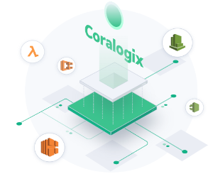

This project is aimed at streaming data from AWS CloudTrail to Coralogix, visualizing logs through an OpenSearch dashboard, and creating alerts for various AWS events. FluentD integration enables custom log data shipment, ensuring enriched log parsing that includes security, geo, and custom AWS region information.

Source: [YOUR SOURCE LINK HERE]
